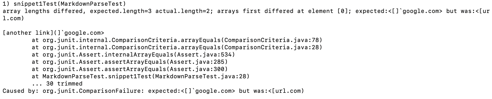
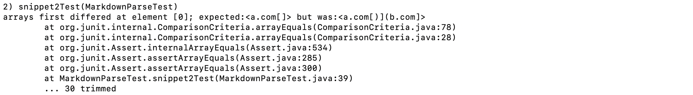
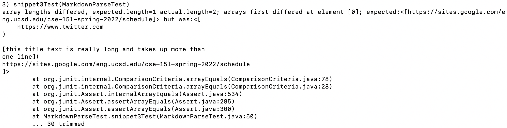

# Lab Report 4

## Part 1: Link to repositories

[This](https://github.com/kcyy127/markdown-parser) is our group's repository. \
[This](https://github.com/Steven-Hsu1/markdown-parser) is the repository we reviewed.

## Part 2: "For each snippet tests above"

### a. decide on what should it produce (Source: CommonMark Demo Site)

1. The expected output for this snippet should be [\`google.com, google.com, ucsd.edu]. 
2. The expected output for this snippet should be [a.com, a.com(()), example.com].
3. The expected output for this snippet should be [https://sites.google.com/eng.ucsd.edu/cse-15l-spring-2022/schedule].

### b. Showing the code in `MarkdownParseTest.java` for how you turned it into a test

Here are the tests I made from the expected output above:

### c. Showing the corresponding output when running the tests:

- Result for Snippet 1: Failed.
- Result for Snippet 2: Failed.
- Result for Snippet 2: Failed.

### d. Showing the corresponding output when running the tests on the implementation we reviewed in week 7:

- Result for Snippet 1: Failed.
- Result for Snippet 2: Failed.
- Result for Snippet 2: Failed.

## Part 3: Free Responses

1. For the first snippet, yes, we just have to add two new variables called `FirstindexOfBackTick` and `SecondindexOfBackTick` in line 16 and 17, and added an if statement to considered the next `[` if the index of `[` is between the two `` ` ``.
2. For the second snippet, no, I think this is more involvedn since inorder to adress the multiple parentheses problem there must be a more advanced method to determine what actually "looks like" a code and work around it (and the method to keep track of the index would get really complicated).
3.  For the third snippet, yes, we could add a variable called `indexOfSpace` and if there is ever a sequence of consecutive index, we directly jump to the next `[` and disregard the current link.

