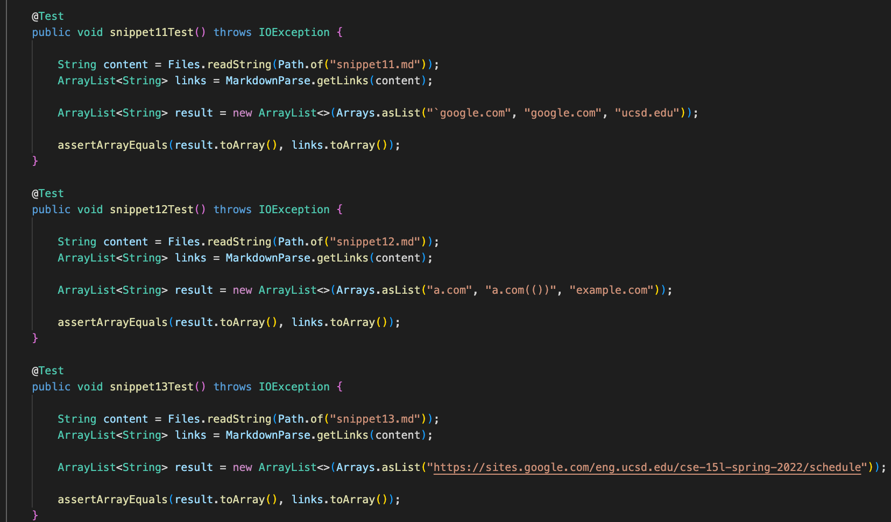

# Lab Report 4

## Part 1: Link to repositories

[This](https://github.com/kcyy127/markdown-parser) is our group's repository. \
[This](https://github.com/Steven-Hsu1/markdown-parser) is the repository we reviewed.

## Part 2: "For each snippet tests above"

### a. decide on what should it produce (Source: CommonMark Demo Site)

1. The expected output for this snippet should be [\`google.com, google.com, ucsd.edu]. 
2. The expected output for this snippet should be [a.com, a.com(()), example.com].
3. The expected output for this snippet should be [https://sites.google.com/eng.ucsd.edu/cse-15l-spring-2022/schedule].

### b. Showing the code in `MarkdownParseTest.java` for how you turned it into a test

Here are the tests I made from the expected output above:

### c. Showing the corresponding output when running the tests:

- Result for Snippet 1: Failed.
- Result for Snippet 2: Failed.
- Result for Snippet 2: Failed.

